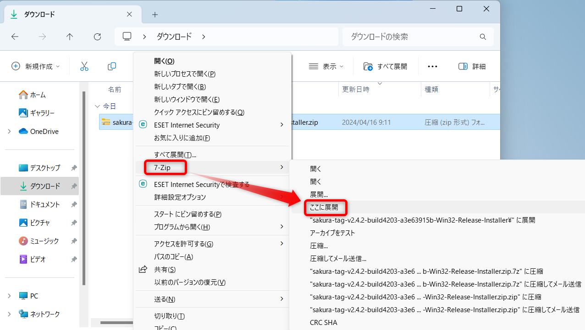
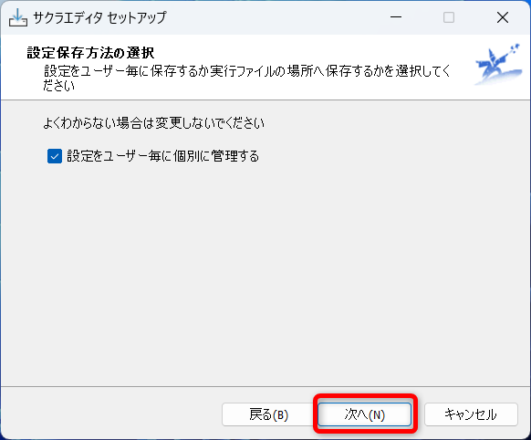

# サクラエディタ

## インストールの手順

### ダウンロード

下記サイトからサクラエディタをダウンロードする  
https://github.com/sakura-editor/sakura/releases

下の方にスクロールする  

`最新版ダウンロード`から`インストーラ、パッケージダウンロード`をクリック  

少しスクロールする

`sakura-tag-v2.4.2～-Installer.zip`をクリックしてダウンロード  

`ダウンロード`フォルダに保存する

### インスール

`Shiftキーを押しながら右クリック`→`7-Zip`→`ここに展開`をクリック  

`sakura_install～.exe`をダブルクリックして起動  

`OK`をクリック  

`次へ`をクリック  

`次へ`をクリック  

`次へ`をクリック  

`次へ`をクリック  

`次へ`をクリック  

`次へ`をクリック  

下記にチェックを入れて`次へ`
- `デスクトップ上にアイコンを作成する`
- 「SAKURA Editorで開く」メニューの追加

`インスール`をクリック  

`完了`をクリック  

デスクトップ上のアイコンからサクラエディタを起動

- Windowsに付属しているメモ帳の高機能版のようなツール
- 軽量なので、ちょこっとテキストデータを編集したい時に便利